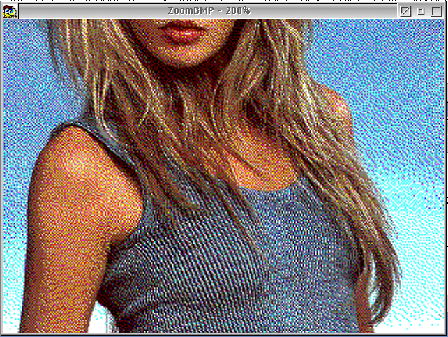

# DEV-SAMPLES-C-PM-ZoomBMP

Sample PM program demonstrating bitmap zoom using GpiWCBitBlt.



Left-click to zoom in, right-click to zoom out. The title bar shows the
current zoom percentage.

## LICENSE
* BSD 3 Clause

## COMPILE TOOLS
* yum install git gcc make libc-devel binutils watcom-wrc watcom-wlink-hll watcom-wcc

## PROJECT LAYOUT
```
src/            - All C, H, RC, DEF, ICO, and BMP source files
img/            - Screenshots
doc/            - Documentation
bin-gcc/        - GCC/kLIBC build output
bin-wat/        - OpenWatcom build output
makefile.gcc    - GNU make rules for GCC build
makefile.wat    - wmake rules for OpenWatcom build
compile_gcc.cmd - Run the GCC build
compile_wat.cmd - Run the OpenWatcom build
```

## HOW TO COMPILE

**GCC / kLIBC:**
```
compile_gcc.cmd
```
Output: `bin-gcc\zoombmp.exe`. Build log: `make_gcc.out`.

**OpenWatcom:**
```
compile_wat.cmd
```
Output: `bin-wat\zoombmp.exe`. Build log: `make_wat.out`.

## AUTHORS
* John Webb / IBM Corp (original, 1993)
* Martin Iturbide (2023, 2026)

## CHANGE HISTORY
* 1.02 - 2026-09-07 - Sources moved to src/; dual GCC and OpenWatcom build support added; fixed USHORT→ULONG msg in MainWindowProc, PCSZ→PSZ in WinSetWindowText, return(FALSE)→(MRESULT)FALSE, added return 0 at end of main(); screenshot moved to img/.
* 1.01 - 2023-04-28 - Initial ArcaOS port (GCC build).

## LINKS
* 
